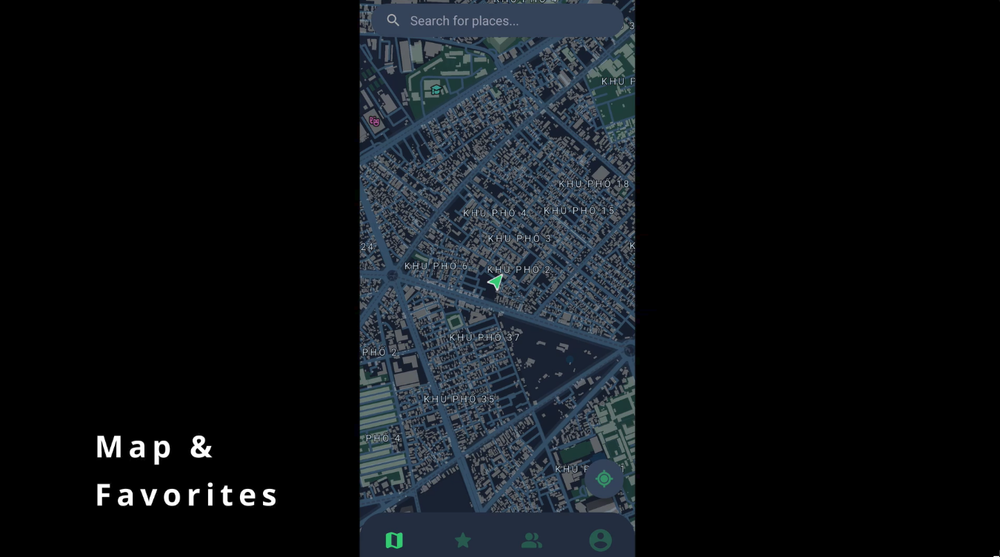
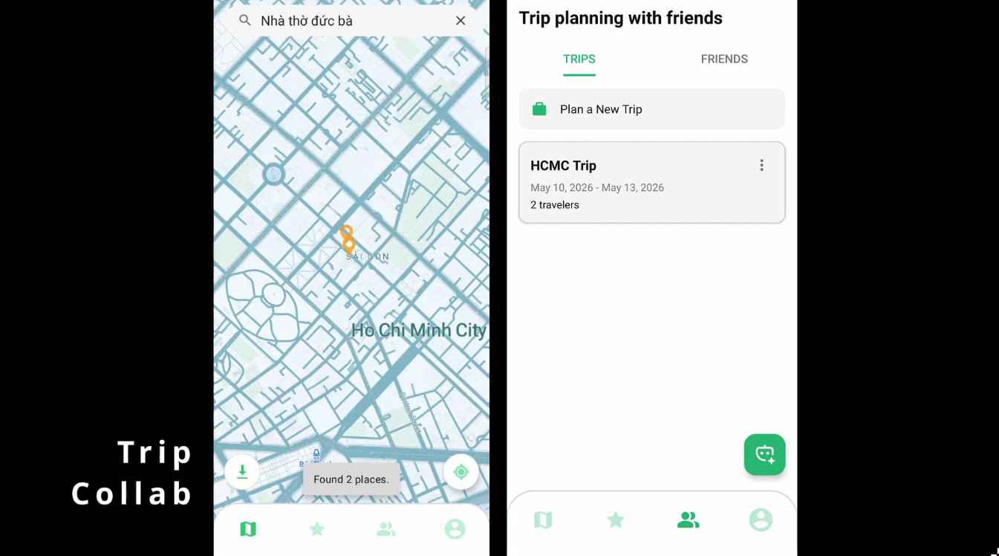
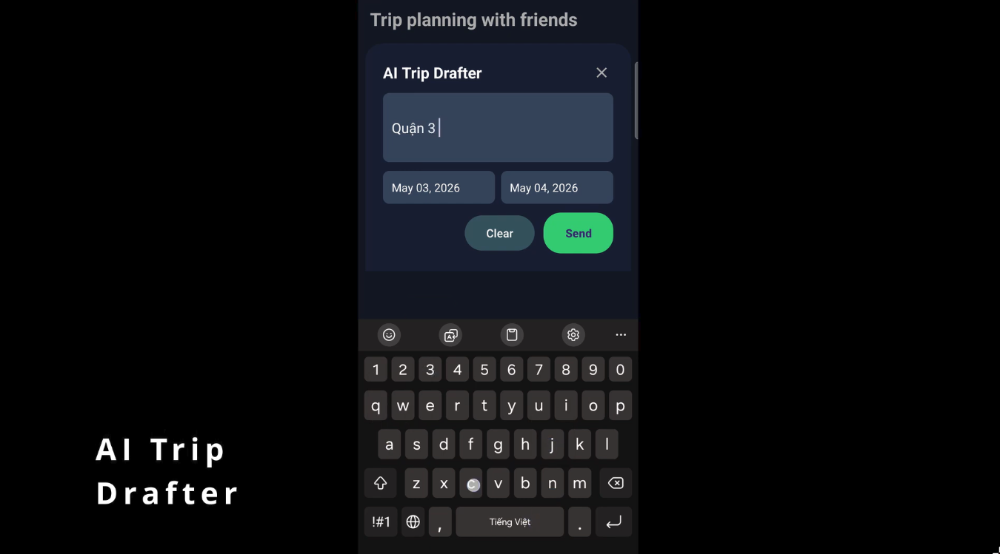

# Bring In Friends


[](https://opensource.org/licenses/MIT)
[](https://developer.android.com)
[](https://www.java.com)
[](https://android-arsenal.com/api?level=29)

**Bring In Friends** is an offline-first social mapping platform built as:

- a modular native Android app under `android/`
- a Spring Boot backend under `server/`
- a local infrastructure stack for MongoDB, OSRM, Typesense, Ollama, and optional debug tooling

The current codebase centers on location sharing, favorites, social collaboration, trip planning, sync, and AI-assisted place/trip suggestions.

## Current Feature Set

### Android app

- **Auth flows**: register with email OTP, login, refresh, forgot-password OTP, and change password.
- **Map experience**: MapLibre-based map UI, place search, place detail/review flows, route rendering, and city map bundle download.
- **Favorites**: synced favorites with notes, ratings, and detail views.
- **Social**: friend requests, group management, shared chat, and friend-specific location/trip views.
- **Trips**: collaborative trip creation, itinerary stop management, stop reordering, collaborator management, and trip cover image support.
- **Offline-first data**: Room persistence, sync queue handling, WorkManager-backed uploads/cleanup, and conflict-aware sync integration.
- **Profile management**: editable display profile and avatar metadata with remote media upload support.

### Server

- **REST + GraphQL APIs** for auth, users, groups, places, favorites, trips, chat, sync, reviews, routing, and AI.
- **WebSocket chat endpoints** for realtime group messaging and acknowledgements.
- **Place search stack** with configurable Mongo or Typesense providers.
- **Route computation** through OSRM-backed route endpoints.
- **Media upload signing** for Cloudinary-based avatar and trip media flows.
- **Sync services** for favorites, trips, profiles, groups, reviews, chat, and friendship changes.

## AI Features

The current AI implementation lives under `server/src/main/java/com/bif/server/features/ai/` and is consumed by Android GraphQL clients in `android/core`.

### Implemented capabilities

- **Natural-language place suggestion** with extracted keywords, category/vibe hints, and grounded server-known `Place` results.
- **AI trip drafting** that returns a typed draft plus validated candidate places.
- **Location-aware place suggestions** through optional `latitude`, `longitude`, and `cityBias` GraphQL inputs.
- **Failure-aware responses** that return `warnings` and `failureCode` instead of silent null-style failures.

### Current GraphQL AI contract

- `suggestPlacesFromQuery(query: String!, latitude: Float, longitude: Float, cityBias: String): AiPlaceSuggestionResult!`
- `draftTripFromQuery(query: String!): AiTripDraftResult!`

### AI hardening in code

- schema-constrained Ollama JSON generation
- request auth/rate-limit guards
- post-generation validation for stop counts, durations, uniqueness, and candidate-place membership
- defensive parsing and upstream failure handling

## Demonstration Videos

### Basic Modules
[](https://youtu.be/CuH_xy-xbf8)

### Trip Module
[](https://youtu.be/NkiVaBpUQFY)

### AI Features
[](https://youtu.be/R8aX6LuwcV8)

## Technology Stack

### Android

- **Language**: Java
- **App package**: `com.bif.app`
- **Build**: Gradle multi-module project with version catalogs
- **Modules**: `app`, `core`, `data`, `domain`, `brouter`, `feature:*`
- **Architecture**: modular clean-ish separation with repositories, Room entities/DAO, feature fragments, and shared core/network layers
- **UI**: Android Fragments + Material Components + Navigation
- **Dependency injection**: Hilt
- **Persistence**: Room
- **Networking**: Retrofit + Apollo Java GraphQL + WebSocket/STOMP support
- **Maps/Routing**: MapLibre, OSRM integration, embedded BRouter assets/cache support
- **Background work**: WorkManager + AndroidX Startup
- **SDK**: minSdk 29, target/compileSdk 36

### Server

- **Framework**: Spring Boot 4.0.6
- **Language / toolchain**: Java with JDK 21 toolchain
- **Build**: Gradle + JaCoCo + Checkstyle
- **Database**: MongoDB
- **API surfaces**: Spring MVC REST, Spring GraphQL, Spring WebSocket
- **Search**: Mongo search or optional Typesense
- **Routing**: OSRM
- **Media**: Cloudinary signed uploads
- **Email**: Brevo-backed OTP email delivery
- **Optional AI runtime**: Ollama

## Project Structure

```text
BIF-Mobile-App/
├── .github/workflows/           # CI/CD and security workflows
├── android/
│   ├── app/                     # app shell, navigation, DI bootstrap
│   ├── brouter/                 # bundled/offline routing support assets
│   ├── core/                    # networking, auth/session, shared UI/resources
│   ├── data/                    # repositories, Room DB, sync, workers, routing engines
│   ├── domain/                  # domain models and repository contracts
│   └── feature/
│       ├── auth/
│       ├── favorites/
│       ├── map/
│       ├── profile/
│       └── social/
├── init-scripts/                # map/bootstrap/cache generation scripts
├── map-data/                    # OSM/Overture/OSRM/BRouter artifacts
├── server/
│   ├── src/main/java/com/bif/server/common/
│   ├── src/main/java/com/bif/server/features/
│   │   ├── ai/
│   │   ├── auth/
│   │   ├── chat/
│   │   ├── favorite/
│   │   ├── friendship/
│   │   ├── group/
│   │   ├── map/
│   │   ├── media/
│   │   ├── place/
│   │   ├── route/
│   │   ├── search/
│   │   ├── sync/
│   │   ├── trip/
│   │   └── user/
│   └── src/test/                # controller/service/unit/integration coverage
├── docker-compose*.yml          # local, debug, and image-based stacks
├── Makefile                     # local infra shortcuts
├── PRIVACY_POLICY.md
├── TESTING_GUIDE.md
└── README.md
```

## Local Setup

### 1. Clone the repo

```bash
git clone https://github.com/Schooleo/BIF-Mobile-App.git
cd BIF-Mobile-App
```

### 2. Prepare local configuration

Root environment:

```bash
cp .env.example .env
```

Android local properties:

```bash
cp android/local.properties.example android/local.properties
```

Then update values you actually need:

- `.env`: Mongo, Typesense, Ollama, Brevo, Cloudinary, Tailscale, and feature flags
- `android/local.properties`: Android SDK path, `LOCAL_API_IP`, optional MapLibre style override, optional `CLOUDINARY_CLOUD_NAME`
- `android/app/google-services.json`: required for local/CI Firebase-backed Android builds

### 3. Start the local backend stack

Core services:

```bash
make up
```

Enable optional profiles as needed:

```bash
make up PROFILES="osrm typesense ollama tailscale"
```

Debug-only tools:

```bash
make up-debug PROFILES="db ai logs"
```

Useful lifecycle commands:

```bash
make down
make down-all
make restart
make restart-debug
```

### 4. Run the server locally without Docker (optional)

```bash
cd server
./gradlew bootRun
```

### 5. Build the Android app

```bash
cd android
./gradlew assembleDebug
```

## Map, Routing, and Search Data

Initialize shared place/routing data:

```bash
make init-map
```

Generate a city-scoped bundle around a coordinate:

```bash
make init-city-map LAT=10.7769 LON=106.7009 RADIUS_KM=20
```

Build the Android BRouter cache archive:

```bash
make init-brouter-cache
```

## Testing and Verification

### Android

```bash
cd android
./gradlew test
./gradlew lint
./gradlew :app:checkstyleMain :app:checkstyleTest
```

Instrumented tests:

```bash
./gradlew connectedAndroidTest
```

### Server

```bash
cd server
./gradlew clean test checkstyleMain checkstyleTest jacocoTestReport jacocoTestCoverageVerification
```

### Optional live AI smoke path

Start the required services first:

```bash
make up PROFILES="typesense ollama"
```

Then run:

```bash
make ai-smoke
```

See `TESTING_GUIDE.md` for the fuller testing workflow.

## CI/CD

### Android workflows

- **CI**: `.github/workflows/android-ci.yml`
  - runs security checks, lint, unit tests, app checkstyle, and debug APK build
- **CD**: `.github/workflows/android-cd.yml`
  - builds release AABs, uploads artifacts, distributes to Firebase App Distribution, and can publish to Play Store

### Server workflows

- **CI**: `.github/workflows/server-ci.yml`
  - runs security checks, checkstyle, tests, JaCoCo reporting, coverage verification, and bootJar build
- **CD**: `.github/workflows/server-cd.yml`
  - builds the server JAR, pushes GHCR container images, and uploads a versioned release artifact

### Shared security workflow

- **Workflow**: `.github/workflows/security.yml`
- runs **Gitleaks** before **Snyk**
- supports path-scoped Android or server scans

## Credits & Attribution

Bring In Friends uses open-source software and open geospatial data, including:

- Spring Boot, Spring GraphQL, Spring Security, Spring WebSocket
- MongoDB
- AndroidX, Material Components, Navigation, Hilt, Room, WorkManager
- Retrofit, Apollo Java, OkHttp
- MapLibre Android SDK
- OSRM
- BRouter
- Typesense
- Ollama
- Firebase Analytics
- OpenStreetMap / Geofabrik extracts
- Overture Maps Foundation place data

Please preserve upstream attribution and license obligations when redistributing builds, data, or derived artifacts.

## Contributors

<table>
  <tr>
    <td align="center">
      <a href="https://github.com/KwanTheAsian">
        <br />
        <sub><b>23127020 - Biện Xuân An</b></sub>
      </a><br />
      📝 Business Analyst / Developer
    </td>
    <td align="center">
      <a href="https://github.com/PaoPao1406">
        <br />
        <sub><b>23127025 - Đoàn Lê Gia Bảo</b></sub>
      </a><br />
      🎨 UI/UX Designer / Developer
    </td>
    <td align="center">
      <a href="https://github.com/VNQuy94">
        <br />
        <sub><b>23127114 - Văn Ngọc Quý</b></sub>
      </a><br />
      ⚙️ System Designer / Developer
    </td>
    <td align="center">
      <a href="https://github.com/Schooleo">
        <br />
        <sub><b>23127136 - Lê Nguyễn Nhật Trường</b></sub>
      </a><br />
      💻 Project Manager / Developer
    </td>
  </tr>
</table>
